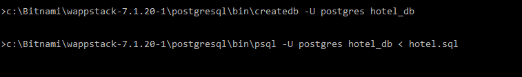
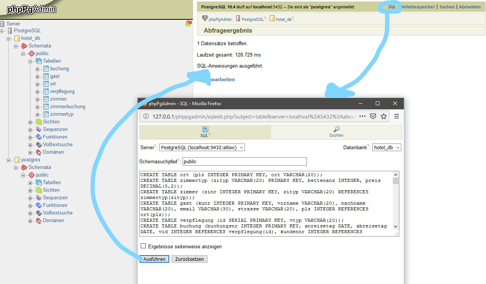

# Hotel Webseite mit Buchungs-Anfrage
Diese Übung zeigt Daten aus einem Datenbank-Projekt des 1.Semesters.

Es gibt eine [Vorlage am Web](https://users.multimediatechnology.at/~bjelline/hotel/), da kannst du das Endergebnis sehen.

Lade dir die [ZIP-Datei](https://gitlab.mediacube.at/bjelline/wp-assignments-public/-/jobs/artifacts/master/raw/hotel.zip?job=zip) herunter und kopiere den Inhalt in einen neuen Ordner namens `hotel/`

Warnhinweis: Zu diesem Zeitpunkt fehlt dir noch das nötige Wissen, um Sicherheitsprobleme in dieser Web-App zu verhindern!

## a) Setup

### Die Datenbank am Server
Am Server **user.multimediatechnology.at** existiert bereits eine Datenbank `hotel_db`.
Mit dem Usernamen db1_reader (für diese Übung ist der User für jeden gleich) und dem bekannten Passwort aus dem Wintersemester kannst
du diese Datenbank abfragen, z.B. auf der Kommandozeile mit psql:

    psql -U db1_reader -h users.multimediatechnology.at hotel_db

Alternativ kannst du auch wieder den Postgres Explorer in deinem VSCode verwenden oder du nutzt ein Programm wie TablePlus.
    
### Die lokale Datenbank
Auf dem eigenen Rechner musst du die Datenbank erst anlegen und befüllen.
Verwende dazu die Datei `hotel.sql`. Auf der Kommandozeile geht das so:

Erst die leere Datenbank anlegen:

    createdb hotel_db

Dann alle SQL-Befehle auf einmal ausführen:

    psql hotel_db < hotel.sql

So sieht das in der Windows Kommandozeile (cmd) aus:

Oder man macht es über die Web-Oberfläche phppgadmin:

phppgadmin findest du unter http://localhost:8080/phppgadmin/ oder http://localhost/phppgadmin. Dazu müssen sowohl der Datenbankserver als auch der Webserver laufen (wenn nötig über die Bitnami-Oberfläche starten). Der User ist `postgres` und das PW ist jenes, welches du bei der Installation verwendet hast.

**ACHTUNG**: Der Zugang zur Datenbank ist auf verschiedenen Servern
(z.B. deinem Entwicklungs-Rechner und dem MMT-Server) verschieden,
und auf jeden Fall vertraulich. Also kann
man diese Information NICHT im Gitlab speichern. Und ja, das `config.php` wird wie alle anderen Dateien im Ordner in den Webspace hochgeladen, sonst funktioniert es nicht. Nur im Repo darf sich das File niemals befinden.

**Füge deiner `.gitignore` Datei den Eintrag "config.php" hinzu.**

Du findest eine Vorlage für `config.php` in `config-sample.php`.
Kopiere diese Datei und füge die fehlenden
Usernamen + Passwörter ein.

Jetzt wäre ein guter Zeitpunkt für ein Commit!

## b) index.php

[Vorlage am Web](https://users.multimediatechnology.at/~bjelline/hotel/)

Wenn ich auf die Homepage komme, will ich die
angebotenen Zimmertypen sehen. Auf jeden Zimmertyp kann
ich klicken, um mehr zu erfahren.

Jetzt wäre ein guter Zeitpunkt für ein Commit!

## c) zimmertyp.php

[Vorlage am Web](https://users.multimediatechnology.at/~bjelline/hotel/zimmertyp.php?zityp=Single-Suite)

Die Seite zimmertyp.php soll jeweils einen Zimmertyp
genauer vorstellen. Die Seite wird immer mit einem Parameter zityp aufgerufen:

    .../zimmertyp.php?zityp=Deluxe-Zimmer
    .../zimmertyp.php?zityp=Superior-Zimmer

Jetzt wäre ein guter Zeitpunkt für ein Commit!

## d) buchungen.php

[Vorlage am Web](https://users.multimediatechnology.at/~bjelline/hotel/buchungen.php)

Eine Seite für die Rezeption: Hier werden alle Buchungen aufgelistet,
mit Anreise- und Abreisetag, Anzahl der Nächte und Anzahl der Zimmer.
Tipp: Hier kannst und sollst du mit **einer** SQL-Query auskommen, indem du `NATURAL JOIN` und `GROUP BY` verwendest.
Auf jede Buchung kann ich klicken, um die Details zu sehen.

Jetzt wäre ein guter Zeitpunkt für ein Commit!

### e) buchung.php

[Vorlage am Web](https://users.multimediatechnology.at/~bjelline/hotel/buchung.php?buchungsnr=19004)

Die Seite `buchung.php` stellt je eine Buchung dar,
und wird immer mit dem Parameter `buchungsnr` aufgerufen:

    .../buchung.php?buchungsnr=1
    .../buchung.php?buchungsnr=7

Hier soll die volle Information der Buchung und
der Gesamt-Preis angezeigt werden.

Jetzt wäre ein guter Zeitpunkt für ein Commit!

# Alternative
Du kannst diese Übung (und die folgenden zwei) auch mit deinem eigenen Datenbank-Projekt aus Einführung Datenbanken im 1. Semester machen.
Das ist etwas mehr Arbeit - du musst selbst entscheiden, welche Teile der Datenbank du jeweils anzeigst.
Also statt Zimmertypen auflisten + Zimmertyp anzeigen eine Tabelle aus deiner Datenbank auflisten und einzelne Datensätze anzeigen. u.s.w.

Beispiele aus dem letzten Jahren waren zum Beispiel:
- Sportpläne aufzählen und einzelne Sportpläne anzeigen
- Pokemontypen auflisten und einzelne Pokemontypen anzeigen
- Filmgenre auflisten und einzelne Genre anzeigen

Am Server kannst du dazu schon mit deiner eigenen Datenbank arbeiten - die Zugriffsdaten hast du schon im Herbst per E-Mail erhalten.

# Abgabe
Am Webspace im Ordner `hotel/` mittels Filezilla oder remote-ssh **UND** im Gitlab-Repo im Ordner `hotel/`.

### Checkliste
- [ ] Lade die Hotelvorlage in den lokalen Ordner `hotel/`
- [ ] Befülle `config.php` mit deinen Zugangsdaten
- [ ] Füge `config.php` zu deinem .gitignore-File hinzu
- [ ] In `index.php` werden alle Zimmertypen aufgelistet und ich kann auf jeden Typen klicken
- [ ] In `zimmertyp.php` wird mir der Zimmertyp genauer ausgegeben, welcher mit `zityp` requested wurde
- [ ] In `buchungen.php` werden alle Buchungen mit Anreise/Abreise, Anzahl Nächte und Anzahl Zimmer aufgelistet. Ich kann auf jede Buchung klicken um mehr zu erfahren.
- [ ] Die Informationen zu einer Buchung wird mit **EINER** SQL-Query abgefragt
- [ ] In `buchung.php` werden mir alle Informationen zur Buchung und der Gesamtpreis angezeigt. Welche Buchung angezeigt wird, wird mit `buchungsnr` übergeben.
- [ ] Die Abgabe ist am Webspace unter `.../hotel` zu finden und funktioniert.
- [ ] Im Repo lässt sich kein `config.php` finden.
- [ ] Und wie immer gilt: HTML Validator wirft keine Fehler und wir bauen nur Seiten mit einer validen HTML Struktur. Nochmal zur Wiederholung: Seitenquelltext jeder Seite in den HTML Validator schmeißen (https://validator.w3.org/#validate_by_input), dann funktioniert es auch mit PHP Dateien.

### Dateiliste
Dateien, die bei dieser Aufgabe verändert oder angelegt werden:
| Datei | Abgabeort | Hinweis |
| ------ | ------ | ------ |
| index.php | Webspace und Repo, hotel/|  Schon vorhanden.
| config.php | Nur Webspace, hotel/ | Enthält die User und PWs zu den Datenbanken
| zimmertyp.php | Webspace und Repo, hotel/ | 
| buchungen.php | Webspace und Repo, hotel/ | 
| buchung.php | Webspace und Repo, hotel/ |

