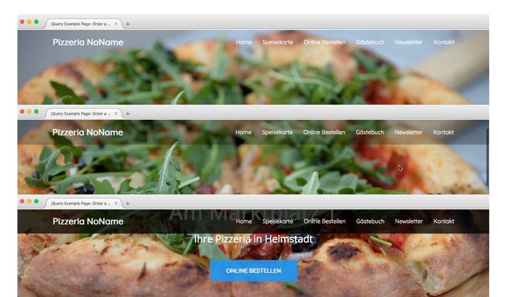
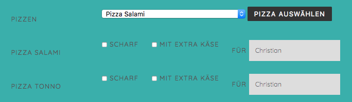

# 'Plain Old' JavaScript üben mit einer fiktiven Pizzeria

Lade die [Zip-Datei](https://gitlab.mediacube.at/bjelline/wp-assignments-public/-/jobs/artifacts/master/raw/pizza.zip?job=zip) herunter, und packe sie aus.  Diese Projekt wird im ordner `pizza/` entwickelt und abgegeben.

Achtung: diese Seite braucht nicht auf Handys und Tablets zu funktionieren! "Responsive" bezieht sich hier nur auf die Bilder!

## a) Fixed-Header-Animation beim Scrollen

Der Header soll fix am oberen Rand der Seite dargstellt werden.
Am Anfang soll er transparent sein. Wenn man nach unten scrollt, soll er etwas schrumpfen und eine schwarze Hintergrundfarbe erhalten. Den Threshold, den es braucht bis sich der Header verändert, kannst du selbst definieren.



In der Datei `vorlage-pizza-phases.png` in der ZIP-Datei siehst du genau, wie
das ausehen soll (Die Bilder sind noch von vor dem Design Update).

Eine Schritt für Schritt Anleitung findest du auf
https://web-development.github.io/applied-js-and-css/header/.

Achtung: Verwende bitte für `header.shrunk` den folgenden Code 
```
/* Die Headerklasse gibt es schon */
header {
  position: fixed;
  display: flex;
  justify-content: space-between;
  align-items: center;
  width: 100%;
  padding: 35px 100px 0;
  color: white;
  z-index: 10;
}

/* Muss ergänzt werden */
header.shrunk {
  background-color: black;
  padding: 15px 100px;  
}
```

Hinweis zu den Unterlagen: Mehrere transitions werden in einer Zeile definiert oder man verwendet transition: all
```
transition: padding 1.5s, background-color 1.5s;
/* oder */
transition: all 1.5s;

```


Hinweis noch zu `will-change: ...`: die zwei Zeilen sollten nur als Behandlung von Performanceproblemen und NICHT bereits präventiv verwendet werden (Mehr dazu [hier](https://developer.mozilla.org/en-US/docs/Web/CSS/will-change)).

## b) Langsam scrollen

Die Links im Navigations-Menü und der "Online Bestellen"
Button enthalten jeweils einen internen Link, der auf dieselbe Seite verweist.
Ändere die Seite so, dass langsam zum Ziel hin gescrollt wird - Tipp: das geht mit CSS.

Eine Schritt für Schritt Anleitung findest du auf
https://web-development.github.io/applied-js-and-css/langsam-scrollen/.

Achtung: Teste zum Schluss, ob der "Back" und "Forward" Button
des Browsers noch funktioniert. Der Wechsel zum nächsten Anchor
in der Seite soll als "Schritt" in der Browserhistory zählen!

## c) Pizza-Auswahl ganz anders

Gestalte die Pizza-Auswahl neu und ganz anders: Es soll möglich
sein, zusätzliche Zeilen mit einer Pizza-Auswahl ins Formular einzufüllen.
Das Formular selbst ändert sich also:



Siehe `vorlage_form.png`.

Man soll aus einem Dropdown eine Pizza auswählen können. Ist eine Pizza ausgewählt, 
kann man noch über zwei Checkbox Extras auswählen sowie den Namen der Person, der die
Pizza gehört, mittels Textfeld eintragen.

_Zusatzpunkt_: Implementiere eine Funktionalität, mit welcher man eine bereits ausgewählte Pizza auch wieder löschen kann.

Eine Schritt für Schritt Anleitung findest du auf
https://web-development.github.io/applied-js-and-css/dynamisches-formular/.

## d) Responsive Images

Die Website verwendet 6 verschiedene Bilder im Design. Diese Bilder werden auch auf Mobile in der größten Größe geladen. Verwende `srcset` damit immer nur die notwendige Größe geladen wird. Die unterschiedlichen Versionen der Bilder findest du bereits unter `assets/img/`. 

Für die zwei großen Bilder (Hero und Restaurant) verwende srcset und definiere drei versch. Pixeldichten (1x-3x).

Für die 4 Bilder im Abschnitt Speisekarte definiere das `srcset` mit jeweils der Breite und verwende zusätzlich noch `sizes` (kleiner Tipp: die Bilder werden auf Mobile über die ganze Breite angezeigt minus Padding, auf Desktop jedoch entweder als eine große oder eine kleine Kachel, nicht aber über die ganze Breite).

Das Kapitel zu dieser Aufgabe findest du hier: https://web-development.github.io/grafik/images/. Weitere Informationen zu responsive Images findest du auch hier in diesem Artikel: https://css-tricks.com/a-guide-to-the-responsive-images-syntax-in-html/#using-srcset.

### Hinweis zum Testen:
Solltest du mit den Bildern Probleme haben, versuche beim Network-Tab in den Dev-Tools den Cache zu disablen.

## e) Validator checken!
Checke vor Abgabe nochmal deine Website mit dem Validator und achte vor allem auf ALT-Tags und Labels.

## Checkliste
- [ ] Der Header verändert sich bei Scrollen. Sowohl Hintergrund als auch Padding verändern sich "langsam".
- [ ] Bei einem Klick auf einen Link wird "smooth" zu dem jeweiligen Abschnitt gescrollt. "Back" und "Forward" funktioniert.
- [ ] Das Formular wurde überarbeitet: man kann Pizzen jetzt über ein Dropdown auswählen.
- [ ] Jede ausgewählt Pizza kann über zwei Checkbox und ein Textfeld noch personalisiert werden.
- [ ] **Zusatzpunkt**: Man kann eine bereits ausgewählte Pizza auch wieder löschen.
- [ ] Das Hero- und Restaurantbild werden über `srcset` und Pixeldichte geladen.
- [ ] Die 4 Speisekarten-Bilder werden über `srcset` und Breite sowie mit Hilfe von `media-queries`in `sizes` geladen.
- [ ] Und wie immer gilt: HTML Validator wirft keine Fehler und wir bauen nur Seiten mit einer validen HTML Struktur. 

## Dateiliste
Dateien, die bei dieser Aufgabe verändert werden:
| Datei | Abgabeort | Hinweis |
| ------ | ------ | ------ |
| index.html | Webspace und Repo, pizza/ |
| script.js | Webspace und Repo, pizza/assets/js | 
| styles.css | Webspace und Repo, pizza/assets/css | 
