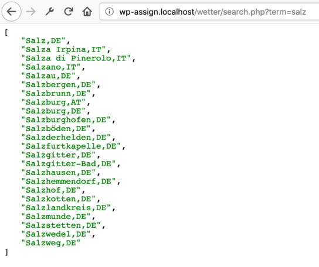
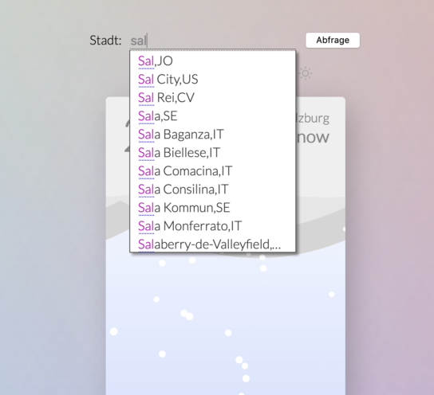

# Ein Javascript-Programm durchschauen und ändern 2 - Wetter
Diese Übung ist wieder eine Einzelübung.

Lade die [Zip-Datei](https://gitlab.mediacube.at/bjelline/wp-assignments-public/-/jobs/artifacts/master/raw/wetter.zip?job=zip) herunter und entpacke sie in deinem Webspace. Der Ordner soll `wetter/` heißen.

## 1 - Analyse

Die Seite kann verschiedene Wetterlagen mit schönen Animationen darstellen.
Die Icons am oberen Rand der Karte sind Links, die ein Umschalten
der Anzeige auslösen.

Lies den Code und finde heraus, wie man die Anzeige mit JavaScript umschalten kann.

Ergebnis: eine Zeile Javascript, die du in den Web Developer Tools in die
Console eintippen kannst, und die auf Sonne oder Regen umschalten kann.

Abgabe direkt hier im README: changeweather(weather[3])

## 2 - Autocomplete Backend programmieren

Das Backend ist ein PHP-Programm, das in der
Tabelle `city` Städte nachschlägt. Die Datei `city.sql`
enthält die nötigen SQL Befehle um diese Tabelle anzulegen. Du kannst sie entweder mit phppgadmin (localhost:8080/phppgadmin auf Mac und localhost/phppgadmin auf Windows) oder über den Terminal (`psql -h localhost -U postgres weather < city.sql`, Achtung vorher musst du eine Datenbank `weather` anlegen).

Am Server users.multimediatechnology.at ist diese Tabelle
in der Datenbank `db1` zu finden. 

Programmiere das Backend in der Datei `search.php`

Siehe [Kapitel AJAX, Unter-Kapitel zu Autocomplete](https://web-development.github.io/applied-js-and-css/ajax/#slide-11).

Der Aufruf von `search.php?term=salz` liefert eine JSON-Array
mit Städte-Namen die mit `salz` beginnen.

So sieht ein Aufruf im Browser auf, wenn es funktioniert:

## 3 - Autocomplete Frontend einbauen

Baue Autocomplete in das Eingabefeld `#cityinput` ein.

Lies [Kapitel AJAX, Unter-Kapitel zu Autocomplete](https://web-development.github.io/applied-js-and-css/ajax/#slide-11).

Ziel: Beim Eintippen von drei Buchstaben wird eine Liste
von möglichen Werten angezeigt.

So sieht ein Aufruf im Browser auf, wenn es funktioniert:

## 4 - Wetterdaten laden

Melde dich bei http://openweathermap.org/price/ an (gratis Version!) und kopiere
den Api Key herunter.

Ergänze die Seite `index.html` um ein paar Zeilen JavaScript:
Wenn der Button "Abfrage" gedrückt wird, soll der
Name der Stadt aus dem Eingabefeld gelesen werden
und eine Anfrage an die openweathermap-API geschickt werden.

Gib die Daten die die API liefert erst einmal auf
der console aus, z.B. mit `console.dir`.

Infos zu der Response:
- [Wie wird das Wetter zurückgegeben?](https://openweathermap.org/weather-conditions )
- [Wie komm ich an die Wetterdaten?](https://openweathermap.org/current#name )

## 5 - Wetterdaten anzeigen

Wenn die Daten der API geliefert werden,
sollen sie auf verschiedene Art verwendet werden:

- Die Temperatur soll auf eine ganze Zahl abgerundet, und in `.temp` angezeigt werden.
- Der Name der Stadt soll in `#city` angezeigt werden.
- Das aktuelle Wetter (in Text) wird bei `#summary` ausgegeben.
- Je nach Wetter-Code (siehe [Dokumentation](https://openweathermap.org/weather-conditions#Weather-Condition-Codes-2 )) soll die passende Animation angezeigt werden. Die Zuordnung passt nicht ganz zu unseren Möglichkeiten, eine ungefähres Mapping geht völling in Ordnung.

## 6 - openweatherapi über PHP Proxy

Nicht jede API lässt sich vom Client aus direkt verwenden.
Manchmal will man die Abfragen an die API vom Backend machen,
um sie dort zu bündeln und zu cachen. Das geht so:

Schreibe ein kurzes PHP Programm, das die Anfrage an die openweatermap-API erledigt,
und baue dieses Programm als proxy ein. Siehe

[Kapitel AJAX: Zugriff auf eine API über lokales Backend](https://web-development.github.io/applied-js-and-css/ajax/#slide-15)

## Checkliste
- [ ] Beantwortung von 1) in diesem `README.md`
- [ ] `search.php?term=salz` funktioniert
- [ ] Autocomplete funktioniert ab 3 Buchstaben
- [ ] Es gibt eine Verbindung zur API und die richtigen Daten zur Suche werden dargestellt 
(Name der Stadt, Temperatur, aktuelles Wetter als Text und die passende Animation)
- [ ] API über Proxy funktioniert
- [ ] Und wie immer gilt: HTML Validator wirft keine Fehler und wir bauen nur Seiten mit einer validen HTML Struktur. Nochmal zur Wiederholung: Seitenquelltext jeder Seite in den HTML Validator schmeißen (https://validator.w3.org/#validate_by_input), dann funktioniert es auch mit PHP Dateien. **Achtung: HTML Validator Fehler bzgl. style im Body (besteht auch bei Brigittes Vorlage) wird nicht als Fehler bewertet!**

## Dateiliste
Dateien, die bei dieser Aufgabe verändert oder angelegt werden:
| Datei | Abgabeort | Hinweis |
| ------ | ------ | ------ |
| index.html | Webspace und Repo, wetter/ |
| README.md | Webspace und Repo, wetter/ | Enthält die Antworten zu #1
| search.php | Webspace und Repo, minitodo/ | 

